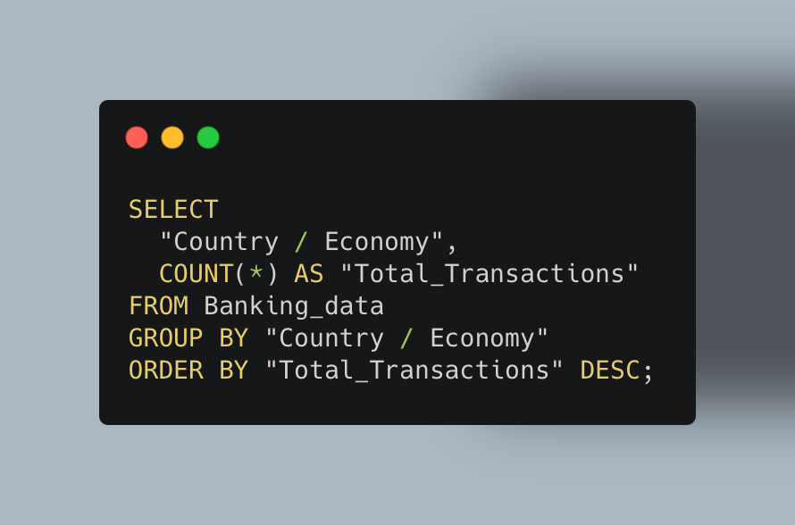
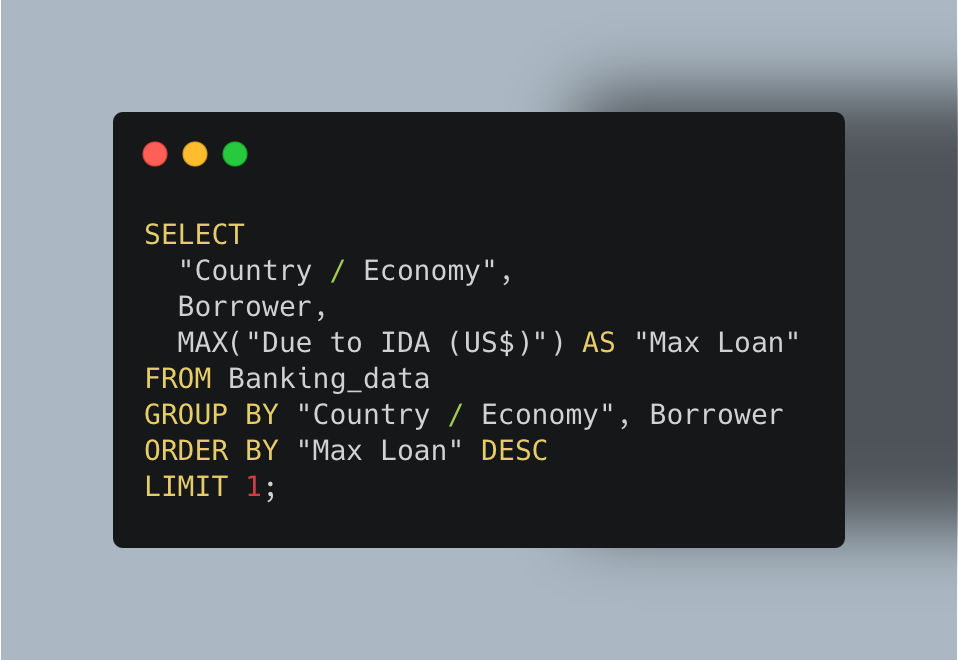
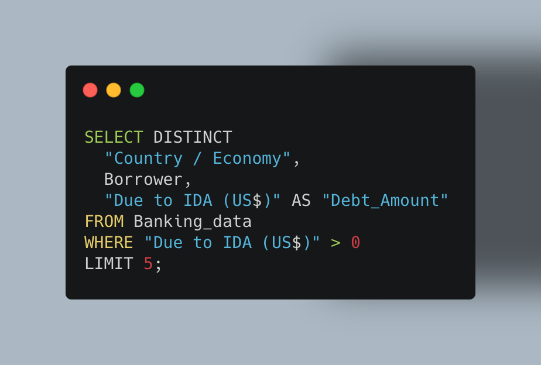
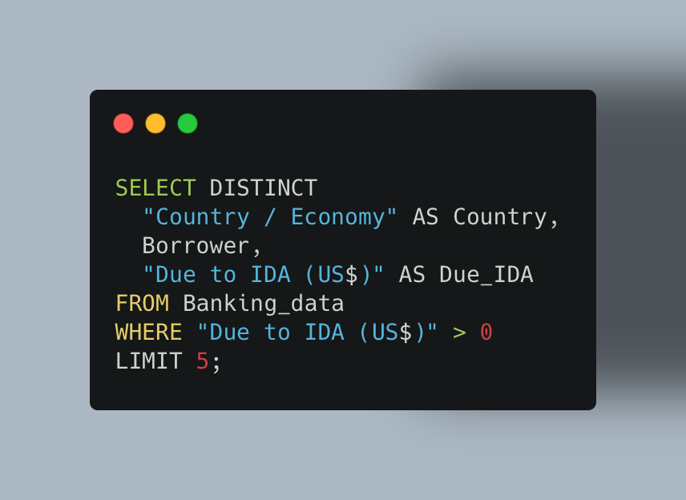

# World Bank Loan Analysis — SQL Project

  
*Figure: Visualizing loan amounts across countries.*
 
### Why This Project?  
As a data analyst for the World Bank’s International Development Association (IDA), my first mission was to analyze our historical loan data and provide clear, data-driven insights. The goal? To understand borrowing patterns, identify top borrowers, and detect trends that can guide future lending strategies.
With billions in loans across dozens of countries, I knew SQL was the fastest and most reliable way to extract exactly what decision-makers needed.
 

### Key Questions & Insights
- Where does our lending footprint begin?
- Who are the biggest players in our loan history?
- What is the largest single loan we’ve ever issued?
- What does the first glimpse of borrower debt look like?
- Can we make our data easier to work with?
 
 

### The Data

The dataset comes from the World Bank's International Development Association (IDA) records, tracking global loans, grants, and guarantees. It includes borrower names, loan amounts, repayment details, and service charge rates, providing insights into how countries manage debt. 

You can explore the live dataset here: [World Bank IDA Loan Data](https://financesone.worldbank.org/ida-statement-of-credits-grants-and-guarantees-historical-data/DS00976)

To analyze the dataset, I used SQL along with CSVfiddle.io for querying the data. Given CSVfiddle's limited memory capacity, I applied a LIMIT clause to efficiently manage large data volumes and streamline processing.

### 1️⃣ Where Does Our Lending Footprint Begin?

Every data journey starts with understanding the full scope of what we’re working with.  
My first step was to explore the **entire dataset** without applying any filters.  
This gave me a sense of the scale of the World Bank’s International Development Association (IDA) lending operations — from small nations with just a handful of loans to large economies with decades of borrowing history.

By pulling all records, I could:
- Confirm the dataset’s structure and data quality.
- See the earliest and most recent lending activities.
- Establish a **baseline** for later analysis, ensuring that trends and patterns would be interpreted in the right historical context.

**SQL Query — Inspect the Entire Dataset**

### 2️⃣ Who Are the Biggest Players in Our Loan History?

After understanding the scope of the dataset, I wanted to see which countries appear most often in our lending records.  
By counting the total number of transactions per country, I could quickly identify our most active borrowers and get a sense of where the World Bank’s engagement is highest.

**SQL Query — Transactions per Country**

**Query Result**

**Why this matters**
- Highlights countries with the **strongest engagement** with the World Bank.
- Helps prioritize **relationship management** and monitoring efforts.
- Identifies potential regions for **deeper financial analysis** and risk assessment.

### 3️⃣ What Is the Largest Single Loan We’ve Ever Issued?

To understand the most significant financial commitments in our history, I searched for the largest individual loan in the dataset.  
Finding this value helps the World Bank assess concentrated lending risks and identify countries or borrowers with exceptionally high exposure.

Using the `MAX()` function, I was able to quickly locate the biggest “Due to IDA” amount in a single record, along with the borrower and country details.  
This provides critical insight for risk management teams and supports discussions on portfolio diversification.

**SQL Query — Largest Single Loan**

**Query Result**

**Why this matters**
- Highlights the largest single financial commitment in our lending history.
- Helps evaluate exposure to specific borrowers or countries.
- Supports strategic decisions on future loan caps or diversification targets.
  
### 4️⃣ What Does the First Glimpse of Borrower Debt Look Like?

Before diving deep into trends and extremes, it’s useful to get an immediate, unfiltered look at borrower debt—while making sure we only see meaningful amounts.  
By retrieving a small sample of the data and filtering out zero or null values, I could:
- Verify the structure and integrity of the debt column.
- Avoid irrelevant records that don’t reflect actual obligations.
- Begin spotting early patterns in where substantial debts are concentrated.

Using `LIMIT` with a `WHERE` filter, I displayed the first five non-zero debt records.  
This gave me a snapshot of the scale of individual loan amounts and ensured the `"Due to IDA (US$)"` field contained actionable data for later analysis.

**SQL Query — First 5 Borrower Debt Records (Non-Zero Only)**

**Query Result**

**Why this matters**
- Excludes records that could distort early insights.
- Provides a quick validation of the financial data’s usability.
- Sets the stage for accurate aggregation and trend analysis.

### 5️⃣ Can We Make Our Data Easier to Work With?

When working with real-world datasets, one of the first productivity wins is **renaming complex column headers** into simpler, query-friendly names.  
The original dataset contained columns like `"Country / Economy"` and `"Due to IDA (US$)"` — which are descriptive but cumbersome to type repeatedly in SQL queries.  

By using the `AS` keyword, I created short aliases that make my queries cleaner, faster to write, and easier to read.  
This small adjustment can significantly reduce the chance of syntax errors and improve collaboration, especially when queries are shared across teams.

**SQL Query — Create Shorter Column Names**

**Query Result**

**Why this matters**
- Makes queries **easier to write** and less error-prone.
- Improves **readability** when sharing SQL scripts.
- Provides a consistent naming convention for later analysis and dashboards.

