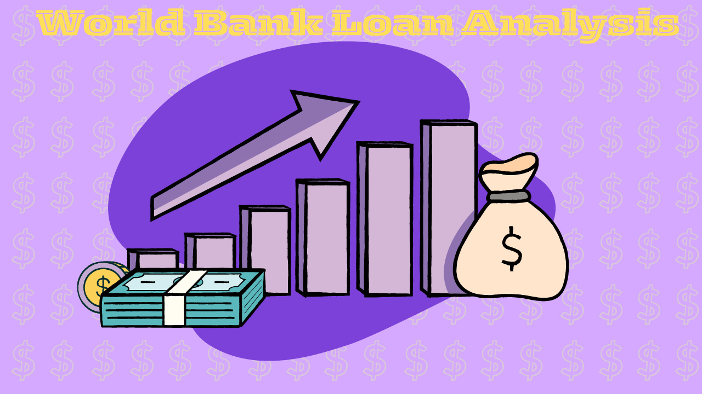

# World Bank Loan Analysis — SQL Project

  
*Figure: Visualizing loan amounts across countries.*
 
### Why This Project?  
As a data analyst for the World Bank’s International Development Association (IDA), my first mission was to analyze our historical loan data and provide clear, data-driven insights. The goal? To understand borrowing patterns, identify top borrowers, and detect trends that can guide future lending strategies.
With billions in loans across dozens of countries, I knew SQL was the fastest and most reliable way to extract exactly what decision-makers needed.
 

### Key Questions & Insights

- *Which countries have the most and fewest active borrowers?*

- *Who are the top five borrowers by total loan count?*

- *Which country had the most recent repayment activity?* 

- *Which country has the highest average loan amount?* 

- *Which countries have never missed a repayment date?*
 
- *Which country holds the largest cumulative debt?* 

- *Largest year-over-year increase in borrowing*
- *Loan status distribution*
 
 
### The Data

The dataset comes from the World Bank's International Development Association (IDA) records, tracking global loans, grants, and guarantees. It includes borrower names, loan amounts, repayment details, and service charge rates, providing insights into how countries manage debt. 

You can explore the live dataset here:  <a(https://financesone.worldbank.org/ida-statement-of-credits-grants-and-guarantees-historical-data/DS00976)">World Bank IDA Loan Data</a>

To analyze the dataset, I used SQL along with CSVfiddle.io for querying the data. Given CSVfiddle's limited memory capacity, I applied a LIMIT clause to efficiently manage large data volumes and streamline processing.

