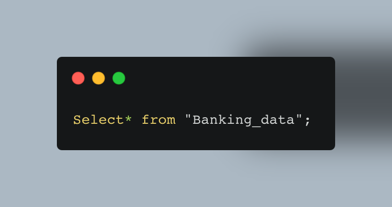

# World Bank Loan Analysis — SQL Project

  
*Figure: Visualizing loan amounts across countries.*
<br>
### Why This Project? <br>
As a data analyst for the World Bank’s International Development Association (IDA), my first mission was to analyze our historical loan data and provide clear, data-driven insights. The goal? To understand borrowing patterns, identify top borrowers, and detect trends that can guide future lending strategies.
With billions in loans across dozens of countries, I knew SQL was the fastest and most reliable way to extract exactly what decision-makers needed.
<br>

### Key Questions & Insights
- Where does our lending footprint begin?
- Who are the biggest players in our loan history?
- What is the largest single loan we’ve ever issued?
- What does the first glimpse of borrower debt look like?
- Can we make our data easier to work with?
 
<br>
### The Data

The dataset comes from the World Bank's International Development Association (IDA) records, tracking global loans, grants, and guarantees. It includes borrower names, loan amounts, repayment details, and service charge rates, providing insights into how countries manage debt. 

You can explore the live dataset here: [World Bank IDA Loan Data](https://financesone.worldbank.org/ida-statement-of-credits-grants-and-guarantees-historical-data/DS00976)

To analyze the dataset, I used SQL along with CSVfiddle.io for querying the data. Given CSVfiddle's limited memory capacity, I applied a LIMIT clause to efficiently manage large data volumes and streamline processing.

### 1️⃣ Where Does Our Lending Footprint Begin?

Every data journey starts with understanding the full scope of what we’re working with.  
My first step was to explore the **entire dataset** without applying any filters.  
This gave me a sense of the scale of the World Bank’s International Development Association (IDA) lending operations — from small nations with just a handful of loans to large economies with decades of borrowing history.

By pulling all records, I could:
- Confirm the dataset’s structure and data quality.
- See the earliest and most recent lending activities.
- Establish a **baseline** for later analysis, ensuring that trends and patterns would be interpreted in the right historical context.

---

**SQL Query — Inspect the Entire Dataset**




### 2️⃣ Who Are the Biggest Players in Our Loan History?

After understanding the scope of the dataset, I wanted to see which countries appear most often in our lending records.  
By counting the total number of transactions per country, I could quickly identify our most active borrowers and get a sense of where the World Bank’s engagement is highest.

---

**SQL Query — Transactions per Country**
```sql
SELECT
  "Country / Economy",
  COUNT(*) AS total_transactions
FROM ida_loans
GROUP BY "Country / Economy"
ORDER BY total_transactions DESC;
```


**Result**
```
-- Paste your top 10 countries and their transaction counts here
```

---

**Why this matters**
- Highlights countries with the **strongest engagement** with the World Bank.
- Helps prioritize **relationship management** and monitoring efforts.
- Identifies potential regions for **deeper financial analysis** and risk assessment.


